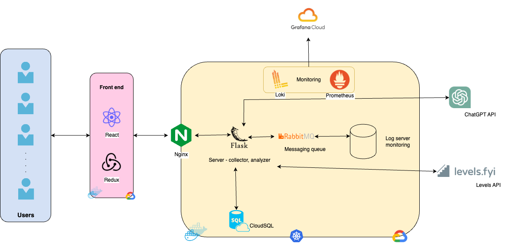

<div align="center">
  <p>
    
  </p>

  <h1 align="center">Idiosyncratics</h1>

  <p align="center">
    CSCI 5828 - Foundations of Software Engineering
    <br/>

</div>


<!-- TABLE OF CONTENTS -->
<details>
  <summary>Table of Contents</summary>
  <ol>
    <li>
      <a href="#about-the-project">About The Project</a>
      <ul>
        <li><a href="#technologies">Technologies</a></li>
        <li><a href="#architecture">Architecture</a></li>
      </ul>
    </li>
    <li>
      <a href="#getting-started">Getting Started</a>
      <ul>
        <li><a href="#prerequisites">Prerequisites</a></li>
        <li><a href="#installation">Installation</a></li>
      </ul>
    </li>
    <li><a href="#continuous-integration-and-deployment">Continuous Integration and Deployment</a></li>
    <li><a href="#future-work">Future work</a></li>
    <li><a href="#authors">Authors</a></li>
  </ol>
</details>


<br>

## Rubric

| Syntax      | Implementation |
| ------------------------------------- | ----------- |
| Web application basic form, reporting | [UI code](react-ui)   |
| Data collection                       | API for collecting Resume as PDF https://github.com/CSCI-5828-Foundations-Sftware-Engr/idiosyncratics/blob/8dfaa538d9560a358986380fd57ed1f294c243ba/flask-api/api/routes.py#L220 API for collecting Resume as Text https://github.com/CSCI-5828-Foundations-Sftware-Engr/idiosyncratics/blob/8dfaa538d9560a358986380fd57ed1f294c243ba/flask-api/api/routes.py#L243 API for collecting Job Description https://github.com/CSCI-5828-Foundations-Sftware-Engr/idiosyncratics/blob/8dfaa538d9560a358986380fd57ed1f294c243ba/flask-api/api/routes.py#L269 |
| Data analyzer                         | [Resume parser](https://github.com/CSCI-5828-Foundations-Sftware-Engr/idiosyncratics/blob/main/flask-api/api/resume_parser/resume_parser.py), [Resume Score calculator](https://github.com/CSCI-5828-Foundations-Sftware-Engr/idiosyncratics/blob/main/flask-api/api/resume_parser/resume_score.py), [Suggested Message for Recruiter using Open API](https://github.com/CSCI-5828-Foundations-Sftware-Engr/idiosyncratics/blob/main/flask-api/api/resume_parser/suggested_message.py) |
| Unit tests                            | 14 Unit [test cases](https://github.com/CSCI-5828-Foundations-Sftware-Engr/idiosyncratics/blob/main/flask-api/tests.py) using pytest and 24 unit tests cases using [jest](https://github.com/CSCI-5828-Foundations-Sftware-Engr/5828_s23/wiki/Idiosyncratics-Testing) |
| Data persistence any data store       | [Google Cloud SQL](resources/Cloud-sql.png), [Table initilization](https://github.com/CSCI-5828-Foundations-Sftware-Engr/idiosyncratics/blob/main/flask-api/api/initialize.py)|
| Rest API endpoint                     | [Endpoints created using Flask](https://github.com/CSCI-5828-Foundations-Sftware-Engr/idiosyncratics/blob/main/flask-api/api/routes.py) |
| Product environment                   | [Google kubernetes engine](resources/GKE.png), [Terraform configs](https://github.com/CSCI-5828-Foundations-Sftware-Engr/idiosyncratics/tree/main/terraform/infra) |
| Integration tests                     | [Multiple endpoints integration test](https://github.com/CSCI-5828-Foundations-Sftware-Engr/idiosyncratics/blob/8dfaa538d9560a358986380fd57ed1f294c243ba/flask-api/tests.py#L242) |
| Using mock objects or test doubles    | Test Doubles https://github.com/CSCI-5828-Foundations-Sftware-Engr/idiosyncratics/blob/ef7772c6c811bd24ca9e1e4beb18e3f81c79d9c3/flask-api/tests.py#L30, Mock Objects in Backend https://github.com/CSCI-5828-Foundations-Sftware-Engr/idiosyncratics/blob/ef7772c6c811bd24ca9e1e4beb18e3f81c79d9c3/flask-api/tests.py#L107 and Mock Objects in FrontEnd https://github.com/CSCI-5828-Foundations-Sftware-Engr/idiosyncratics/blob/ef7772c6c811bd24ca9e1e4beb18e3f81c79d9c3/react-ui/src/testUtils.js#L6-L9 |
| Continuous integration                | [Github Actions](https://github.com/CSCI-5828-Foundations-Sftware-Engr/idiosyncratics/blob/main/.github/workflows/app-build.yaml) |
| Production monitoring instrumenting   | Grafana Dashboards - [Prometheus](/resources/Grafana-prometheus.png), [Loki](/resources/Grafana-loki.png). Terraform Code to provision these are [here](/terraform/monitoring/)  |
| Acceptance tests                      | [Acceptance Test Cases](https://github.com/CSCI-5828-Foundations-Sftware-Engr/5828_s23/wiki/Idiosyncratics-Testing#acceptance-testing)|
| Event collaboration messaging         | [RabbitMQ service](https://github.com/CSCI-5828-Foundations-Sftware-Engr/idiosyncratics/tree/main/rabbitmq), [Logging with RabbitMQ](https://github.com/CSCI-5828-Foundations-Sftware-Engr/idiosyncratics/blob/33705427b370ac9f3cc883bb3544145d5829ef6d/flask-api/api/routes.py#L33-L50) |
| Continuous delivery                   | [Github actions using Terraform](https://github.com/CSCI-5828-Foundations-Sftware-Engr/idiosyncratics/tree/main/.github/workflows) with [Deployment History](https://github.com/CSCI-5828-Foundations-Sftware-Engr/idiosyncratics/actions) |
| Product demo | [Demo](https://www.youtube.com/watch?v=Kto8foVf0-M&ab_channel=GaganKarunakaraShetty) |


<!-- ABOUT THE PROJECT -->
## About The Project

#### Having a hard time finding an internship or job? Don't know what going wrong? Need an edge to beat the ATS demons? 
#### Well look no further - We present to you _IDIOSYNCRAT_


Idiosyncrat is an intuitive and user friendly application that aides with matching your resume/background experience with a job and present clever ways to gain an edge over the crowd, alongside fast-tracking the process.

#### Features

- Secure account creation, authorization and authentication.
- Intutive flow interface for data collection
- Informative dashboard for presenting extracted stats 
- Data persistence with GCP Cloud SQL
- REST API collaboration with Flask
- React web app
- Relevant job listings piped in through event messaging system
- Continuous integration and delivery with Terraform to provision services and GitHub actions to deploy
- Application deployed in GCP (product envvironment)
- Product monitoring with Grafana-Prometheus-loki
- Code tested thoroughly - Unit tests, acceptance tests, integration tests


<p align="right">(<a href="#top">back to top</a>)</p>

<!-- Technologies -->
## Technologies


#### Front end
* React
* Redux
* Material UI

#### Back end
* Flask REST server
* RabbitMQ
* Natural Language Processing
* nginx
* GCP Cloud SQL


#### Deployment and monitoring
* Docker
* GitHub actions
* Grafana
* Terraform

#### Cloud provider
* Google CLoud Platform

#### Testing
* Pytest
* Jest


<p align="right">(<a href="#top">back to top</a>)</p>


<!-- Architecture -->
## Architecture

<br>

 <p align="center">
    
  </p>

<br>
<p align="right">(<a href="#top">back to top</a>)</p>

<!-- GETTING STARTED -->
## Getting Started

The project follows a microservice architecture. Follow the below steps to setup and run the application locally.

### Prerequisites

The following software, accounts and tools are required to get the project up and running:

* Google cloud account with active credits - To Provision resources
* Docker - To run the containers locally
* GitHub actions - to setup autodeployments


<p align="right">(<a href="#top">back to top</a>)</p>

### Installation

The application components are split into individual containers.

1. Either Git clone or download the code from GitHub
2. Navigate to these two folders ``` react-ui ``` and ``` flask-api``` separately and  run the below commands:

  - ``` docker compose pull ``` - To pull relevant Images
  - ``` docker compose build ``` - To setup dependencies and the containers
  - ``` docker compose up -d ``` - To run the container in detached mode

3. Navigate to ``` localhost:3000  ``` and you should be able to use the application.
4. The backend endpoints are accessible through ``` localhost:5000 ``` - but some are access restricted.
<p align="right">(<a href="#top">back to top</a>)</p>

<!-- CICD -->
## Continuous Integration and Deployment

The application has several github actions configured for it's CICD:

1. [app-build](.github/workflows/app-build.yaml): Builds the docker images and pushes it to dockerhub for all the services.
2. [infra-deploy](.github/workflows/infra-deploy.yml): Runs the terraform plan and apply to deploy the infrastructure on gcp.
3. [infra-cleanup](.github/workflows/infra-cleanup.yml): Runs the terraform destroy to delete the infrastructure on gcp.
4. [app-deploy](.github/workflows/app-deploy.yaml): Runs the terraform plan and apply to deploy the application on the Google Kubernetes Engine provisioned by `infra-deploy` stage.
5. [app-cleanup](.github/workflows/app-cleanup.yaml): Runs the terraform destory to delete the application from the Google Kubernetes Engine provisioned by `infra-deploy` stage.
6. [monitoring-deploy](.github/workflows/monitoring-deploy.yaml): Runs the terraform plan and apply to deploy monitoring tools(Prometheus and Loki) on gke and provisioning grafana cloud stack.
7. [monitoring-destroy](.github/workflows/monitoring-cleanup.yaml): Runs the terraform destroy to delete the monitoring tools on gke and deleting the grafana cloud stack.

<p align="right">(<a href="#top">back to top</a>)</p>

<!-- Future work -->
## Future Work

- Provision to apply for the job through the application 
- Better relevant job recommendations
- Job suggestion based on profile 
- Simpler application tracking


<p align="right">(<a href="#top">back to top</a>)</p>

<!-- Authors -->
## Authors

[Gagan K Shetty](https://www.linkedin.com/in/gagan-k-shetty/)

[Kanaka Samagna Talanki](https://www.linkedin.com/in/kanaka-samagna/)

[Shravani Nindra](https://www.linkedin.com/in/shravani-nindra-165946150/)

[Vishal Prabhachandar](https://www.linkedin.com/in/vishalprabha/)

<p align="right">(<a href="#top">back to top</a>)</p>
